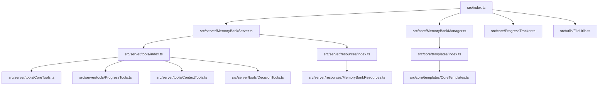

# Modular Architecture Proposal for Memory Bank Server

## Overview

After analyzing the code and project documentation, I propose a modular architecture for the Memory Bank Server, dividing it into smaller and more manageable components. This approach will follow the principles of single responsibility and separation of concerns.

## Current Project Analysis

The current project has the following main responsibilities:

1. **MCP Server Management**: Configuration and execution of the MCP server
2. **Memory Bank Location**: Finding the Memory Bank directory
3. **Memory Bank Initialization**: Creating the initial Memory Bank files
4. **Progress Tracking**: Updating Memory Bank files with progress information
5. **File Handling**: Reading and writing to Memory Bank files
6. **MCP Tools Management**: Defining and implementing MCP tools
7. **MCP Resources Management**: Defining and implementing MCP resources

All these responsibilities are currently in a single file (`src/index.ts`), which makes the code difficult to maintain and evolve.

## Architecture Proposal

### Component Diagram



### Directory Structure

```
src/
├── index.ts                      # Main entry point
├── core/                         # Core Memory Bank logic
│   ├── MemoryBankManager.ts      # Memory Bank management
│   ├── ProgressTracker.ts        # Progress tracking
│   └── templates/                # Templates for Memory Bank files
│       ├── index.ts              # Export all templates
│       └── CoreTemplates.ts      # Templates for main Memory Bank files
├── server/                       # MCP code
│   ├── MemoryBankServer.ts       # Main MCP server class
│   ├── tools/                    # MCP tools
│   │   ├── index.ts              # Export all tools
│   │   ├── CoreTools.ts          # Main tools
│   │   ├── ProgressTools.ts      # Progress tools
│   │   ├── ContextTools.ts       # Context tools
│   │   └── DecisionTools.ts      # Decision tools
│   └── resources/                # MCP resources
│       ├── index.ts              # Export all resources
│       └── MemoryBankResources.ts # Memory Bank resources
└── utils/                        # Utility functions
    └── FileUtils.ts              # Utility functions for file handling
```

## Module Details

### 1. Main Module (`src/index.ts`)

This will be the main entry point for the application. It will import and instantiate the `MemoryBankServer` and start the server.

```typescript
#!/usr/bin/env node
import { MemoryBankServer } from "./server/MemoryBankServer";

const server = new MemoryBankServer();
server.run().catch(console.error);
```

### 2. Memory Bank Management Module (`src/core/MemoryBankManager.ts`)

This class will be responsible for managing the Memory Bank, including location, initialization, and file handling.

```typescript
import fs from "fs-extra";
import path from "path";
import { coreTemplates } from "./templates";
import { FileUtils } from "../utils/FileUtils";

export class MemoryBankManager {
  private memoryBankDir: string | null = null;
  private customPath: string | null = null;

  constructor() {}

  // Methods to manage the Memory Bank
  // ...
}
```

### 3. Progress Tracking Module (`src/core/ProgressTracker.ts`)

This class will be responsible for tracking project progress and updating Memory Bank files.

```typescript
import path from "path";
import { FileUtils } from "../utils/FileUtils";

export class ProgressTracker {
  constructor(private memoryBankDir: string) {}

  // Methods to track progress
  // ...
}
```

### 4. File Utility Module (`src/utils/FileUtils.ts`)

This module will contain utility functions for file handling.

```typescript
import fs from "fs-extra";
import path from "path";

export class FileUtils {
  // Utility functions for file handling
  // ...
}
```

### 5. Template Module (`src/core/templates/CoreTemplates.ts`)

This module will contain templates for main Memory Bank files.

```typescript
export const productContextTemplate = `# Project Overview
// Template content
`;

export const activeContextTemplate = `# Current Context
// Template content
`;

// Other templates...

export const coreTemplates = [
  { name: "productContext.md", content: productContextTemplate },
  { name: "activeContext.md", content: activeContextTemplate },
  // Other templates...
];
```

### 6. MCP Server Module (`src/server/MemoryBankServer.ts`)

This class will be responsible for configuring and executing the MCP server.

```typescript
import { Server } from "@modelcontextprotocol/sdk/server/index.js";
import { StdioServerTransport } from "@modelcontextprotocol/sdk/server/stdio.js";
import { MemoryBankManager } from "../core/MemoryBankManager";
import { ProgressTracker } from "../core/ProgressTracker";
import { setupToolHandlers } from "./tools";
import { setupResourceHandlers } from "./resources";

export class MemoryBankServer {
  // MCP server implementation
  // ...
}
```

### 7. MCP Tools Modules

These modules will contain MCP tools, divided by functionality:

- `src/server/tools/CoreTools.ts`: Main tools
- `src/server/tools/ProgressTools.ts`: Progress tools
- `src/server/tools/ContextTools.ts`: Context tools
- `src/server/tools/DecisionTools.ts`: Decision tools

### 8. MCP Resources Module

This module will contain MCP resources:

- `src/server/resources/MemoryBankResources.ts`: Memory Bank resources

## Benefits of the New Architecture

1. **Separation of Concerns**: Each module has a specific responsibility, making the code easier to understand and maintain.
2. **Testability**: The separation into smaller modules makes it easier to write unit tests.
3. **Code Reuse**: Utility functions and business logic can be reused in different parts of the code.
4. **Scalability**: The modular structure makes it easy to add new features without affecting existing code.
5. **Maintainability**: Bugs and issues are easier to identify and fix in smaller modules.

## Implementation Plan

1. **Phase 1: Initial Refactoring**

   - Create directory structure
   - Move existing code to new modules
   - Ensure existing code continues to work

2. **Phase 2: Improvements**

   - Implement API improvements
   - Add input validation
   - Improve error handling

3. **Phase 3: Tests**

   - Write unit tests for each module
   - Implement integration tests

4. **Phase 4: Documentation**
   - Update documentation to reflect the new architecture
   - Create usage examples

## Conclusion

The proposed architecture divides the project into smaller and more manageable modules, following the principles of single responsibility and separation of concerns. This will make the code easier to understand, maintain, and evolve, as well as facilitate adding new features in the future.
