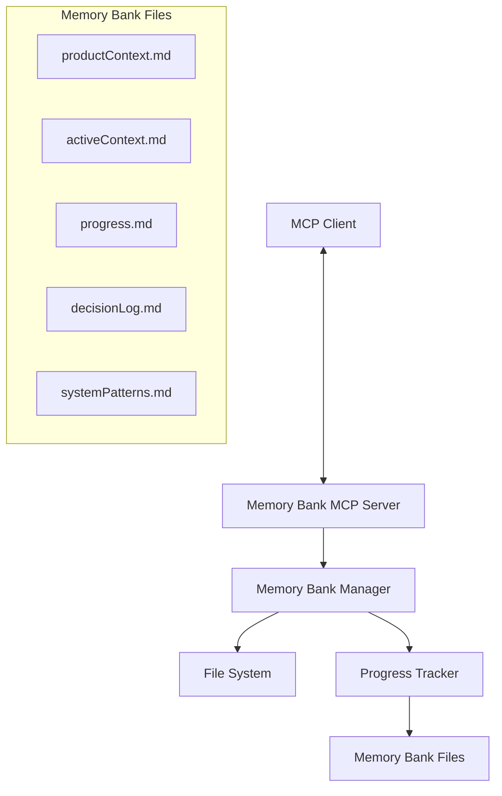
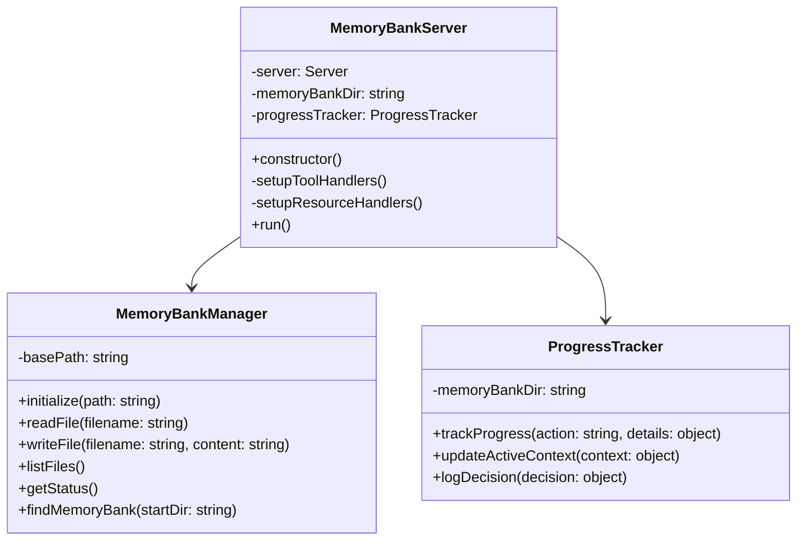
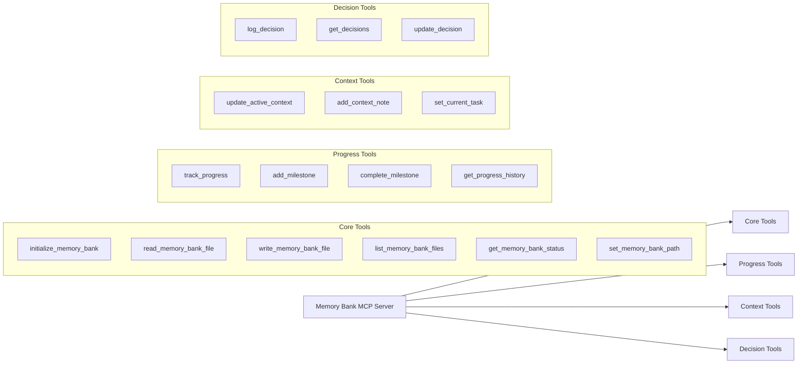

# Memory Bank MCP Server - Architecture Plan

## Overview

The Memory Bank MCP Server is designed to manage a Memory Bank locally through the Model Context Protocol (MCP). This document outlines the architecture and implementation plan for enhancing the server to support English language, progress tracking, and improved MCP compatibility.

## Requirements

1. **English Language Support**: Convert all code and messages to English
2. **Default Directory**: Maintain "memory-bank" as the default directory in the same repository
3. **Custom Path Support**: Allow specifying a custom path for the Memory Bank
4. **Progress Tracking**: Automatically reflect progress in the Memory Bank files
5. **MCP Compatibility**: Ensure broad compatibility with the MCP protocol

## Architecture

### System Architecture Diagram



### Component Architecture



### MCP Tools Architecture



## Implementation Plan

### 1. English Translation

Convert all code to English, including:

- Variable and function names
- Comments
- Error messages and logs
- Default content of Memory Bank files

### 2. Memory Bank Management

#### 2.1 Memory Bank Location

Implement a robust function to find the Memory Bank in the repository:

```typescript
async function findMemoryBankDir(
  startDir: string,
  customPath?: string
): Promise<string | null> {
  // If a custom path is provided, check if it's a valid Memory Bank
  if (customPath) {
    const fullPath = path.resolve(startDir, customPath);
    if (await isMemoryBank(fullPath)) {
      return fullPath;
    }
  }

  // Check the default directory
  const defaultPath = path.join(startDir, "memory-bank");
  if ((await fs.pathExists(defaultPath)) && (await isMemoryBank(defaultPath))) {
    return defaultPath;
  }

  // Check subdirectories
  // ...

  return null;
}
```

#### 2.2 Memory Bank Initialization

Enhance the initialization function to support custom paths and English content:

```typescript
async function initializeMemoryBank(dirPath: string): Promise<void> {
  await fs.ensureDir(dirPath);

  // Create core files if they don't exist
  const coreFiles = [
    {
      name: "productContext.md",
      content: `# Project Overview

## Description
[Project description]

## Objectives
- [Objective 1]
- [Objective 2]
- [Objective 3]

## Technologies
- [Technology 1]
- [Technology 2]
- [Technology 3]

## Architecture
[Architecture description]

## Project Structure
[Project structure description]
`,
    },
    // Other core files...
  ];

  for (const file of coreFiles) {
    const filePath = path.join(dirPath, file.name);
    if (!(await fs.pathExists(filePath))) {
      await fs.writeFile(filePath, file.content);
    }
  }
}
```

### 3. Progress Tracking

Implement a ProgressTracker class to automatically update Memory Bank files:

```typescript
class ProgressTracker {
  constructor(private memoryBankDir: string) {}

  async trackProgress(action: string, details: any): Promise<void> {
    // Update progress.md
    await this.updateProgressFile(action, details);

    // Update activeContext.md
    await this.updateActiveContextFile(action, details);
  }

  private async updateProgressFile(
    action: string,
    details: any
  ): Promise<void> {
    const progressPath = path.join(this.memoryBankDir, "progress.md");
    let progressContent = await fs.readFile(progressPath, "utf-8");

    const timestamp = new Date().toISOString().split("T")[0];
    const newEntry = `- [${timestamp}] - ${action}: ${details.description}`;

    // Add entry to Update History section
    const updateHistoryRegex = /## Update History\s+/;
    progressContent = progressContent.replace(
      updateHistoryRegex,
      `## Update History\n\n${newEntry}\n`
    );

    await fs.writeFile(progressPath, progressContent);
  }

  private async updateActiveContextFile(
    action: string,
    details: any
  ): Promise<void> {
    const contextPath = path.join(this.memoryBankDir, "activeContext.md");
    let contextContent = await fs.readFile(contextPath, "utf-8");

    // Add entry to Current Session Notes section
    const sessionNotesRegex = /## Current Session Notes\s+/;
    const newNote = `- ${action}: ${details.description}`;

    contextContent = contextContent.replace(
      sessionNotesRegex,
      `## Current Session Notes\n\n${newNote}\n`
    );

    await fs.writeFile(contextPath, contextContent);
  }
}
```

### 4. MCP Tools

#### 4.1 Core Tools (Translated to English)

```typescript
{
  name: "initialize_memory_bank",
  description: "Initialize a Memory Bank in the specified directory",
  inputSchema: {
    type: "object",
    properties: {
      path: {
        type: "string",
        description: "Path where the Memory Bank will be initialized",
      },
    },
    required: ["path"],
  },
}
```

#### 4.2 Progress Tracking Tools

```typescript
{
  name: "track_progress",
  description: "Track progress and update Memory Bank files",
  inputSchema: {
    type: "object",
    properties: {
      action: {
        type: "string",
        description: "Action performed (e.g., 'Implemented feature', 'Fixed bug')",
      },
      description: {
        type: "string",
        description: "Detailed description of the progress",
      },
      updateActiveContext: {
        type: "boolean",
        description: "Whether to update the active context file",
        default: true,
      },
    },
    required: ["action", "description"],
  },
}
```

#### 4.3 Context Management Tools

```typescript
{
  name: "update_active_context",
  description: "Update the active context file",
  inputSchema: {
    type: "object",
    properties: {
      tasks: {
        type: "array",
        items: {
          type: "string",
        },
        description: "List of ongoing tasks",
      },
      issues: {
        type: "array",
        items: {
          type: "string",
        },
        description: "List of known issues",
      },
      nextSteps: {
        type: "array",
        items: {
          type: "string",
        },
        description: "List of next steps",
      },
    },
  },
}
```

#### 4.4 Decision Logging Tools

```typescript
{
  name: "log_decision",
  description: "Log a decision in the decision log",
  inputSchema: {
    type: "object",
    properties: {
      title: {
        type: "string",
        description: "Decision title",
      },
      context: {
        type: "string",
        description: "Decision context",
      },
      decision: {
        type: "string",
        description: "The decision made",
      },
      alternatives: {
        type: "array",
        items: {
          type: "string",
        },
        description: "Alternatives considered",
      },
      consequences: {
        type: "array",
        items: {
          type: "string",
        },
        description: "Consequences of the decision",
      },
    },
    required: ["title", "context", "decision"],
  },
}
```

### 5. MCP Resources

Implement resources for direct access to Memory Bank files:

```typescript
this.server.setRequestHandler(ListResourcesRequestSchema, async () => ({
  resources: [
    {
      uri: `memory-bank://product-context`,
      name: `Product Context`,
      mimeType: "text/markdown",
      description: "Project overview and context",
    },
    {
      uri: `memory-bank://active-context`,
      name: `Active Context`,
      mimeType: "text/markdown",
      description: "Current project context and tasks",
    },
    {
      uri: `memory-bank://progress`,
      name: `Progress`,
      mimeType: "text/markdown",
      description: "Project progress and milestones",
    },
    {
      uri: `memory-bank://decision-log`,
      name: `Decision Log`,
      mimeType: "text/markdown",
      description: "Project decisions and rationale",
    },
    {
      uri: `memory-bank://system-patterns`,
      name: `System Patterns`,
      mimeType: "text/markdown",
      description: "System patterns and architecture",
    },
  ],
}));
```

## Implementation Phases

1. **Phase 1: English Translation**

   - Convert all code to English
   - Update default file templates

2. **Phase 2: Core Functionality**

   - Implement robust Memory Bank location
   - Support custom paths
   - Enhance initialization

3. **Phase 3: Progress Tracking**

   - Implement ProgressTracker
   - Add progress tracking tools

4. **Phase 4: MCP Resources**

   - Implement resource handlers
   - Add resource templates

5. **Phase 5: Testing**

   - Create unit tests
   - Perform integration testing

6. **Phase 6: Documentation**
   - Update project documentation
   - Create usage examples

## Conclusion

This architecture plan outlines the enhancements needed to make the Memory Bank MCP Server more robust, with English language support, progress tracking, and improved MCP compatibility. The implementation will follow the phases outlined above, with a focus on maintaining the existing structure while adding new functionality.
