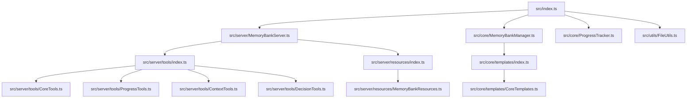

# Proposta de Arquitetura Modular para o Memory Bank Server

## Visão Geral

Após analisar o código e a documentação do projeto, proponho uma arquitetura modular para o Memory Bank Server, dividindo-o em componentes menores e mais gerenciáveis. Esta abordagem seguirá os princípios de responsabilidade única e separação de preocupações.

## Análise do Projeto Atual

O projeto atual tem as seguintes responsabilidades principais:

1. **Gerenciamento do Servidor MCP**: Configuração e execução do servidor MCP
2. **Localização do Memory Bank**: Encontrar o diretório do Memory Bank
3. **Inicialização do Memory Bank**: Criar os arquivos iniciais do Memory Bank
4. **Rastreamento de Progresso**: Atualizar os arquivos do Memory Bank com informações de progresso
5. **Manipulação de Arquivos**: Ler e escrever nos arquivos do Memory Bank
6. **Gerenciamento de Ferramentas MCP**: Definir e implementar as ferramentas MCP
7. **Gerenciamento de Recursos MCP**: Definir e implementar os recursos MCP

Todas essas responsabilidades estão atualmente em um único arquivo (`src/index.ts`), o que torna o código difícil de manter e evoluir.

## Proposta de Arquitetura

### Diagrama de Componentes



### Estrutura de Diretórios

```
src/
├── index.ts                      # Ponto de entrada principal
├── core/                         # Lógica principal do Memory Bank
│   ├── MemoryBankManager.ts      # Gerenciamento do Memory Bank
│   ├── ProgressTracker.ts        # Rastreamento de progresso
│   └── templates/                # Templates para arquivos do Memory Bank
│       ├── index.ts              # Exporta todos os templates
│       └── CoreTemplates.ts      # Templates para arquivos principais
├── server/                       # Código relacionado ao servidor MCP
│   ├── MemoryBankServer.ts       # Classe principal do servidor
│   ├── tools/                    # Ferramentas MCP
│   │   ├── index.ts              # Exporta todas as ferramentas
│   │   ├── CoreTools.ts          # Ferramentas principais
│   │   ├── ProgressTools.ts      # Ferramentas de progresso
│   │   ├── ContextTools.ts       # Ferramentas de contexto
│   │   └── DecisionTools.ts      # Ferramentas de decisão
│   └── resources/                # Recursos MCP
│       ├── index.ts              # Exporta todos os recursos
│       └── MemoryBankResources.ts # Recursos do Memory Bank
└── utils/                        # Utilitários
    └── FileUtils.ts              # Utilitários para manipulação de arquivos
```

## Detalhamento dos Módulos

### 1. Módulo Principal (`src/index.ts`)

Este será o ponto de entrada principal do aplicativo. Ele importará e instanciará o `MemoryBankServer` e iniciará o servidor.

```typescript
#!/usr/bin/env node
import { MemoryBankServer } from "./server/MemoryBankServer";

const server = new MemoryBankServer();
server.run().catch(console.error);
```

### 2. Módulo de Gerenciamento do Memory Bank (`src/core/MemoryBankManager.ts`)

Esta classe será responsável por gerenciar o Memory Bank, incluindo localização, inicialização e manipulação de arquivos.

```typescript
import fs from "fs-extra";
import path from "path";
import { coreTemplates } from "./templates";
import { FileUtils } from "../utils/FileUtils";

export class MemoryBankManager {
  private memoryBankDir: string | null = null;
  private customPath: string | null = null;

  constructor() {}

  // Métodos para gerenciar o Memory Bank
  // ...
}
```

### 3. Módulo de Rastreamento de Progresso (`src/core/ProgressTracker.ts`)

Esta classe será responsável por rastrear o progresso do projeto e atualizar os arquivos do Memory Bank.

```typescript
import path from "path";
import { FileUtils } from "../utils/FileUtils";

export class ProgressTracker {
  constructor(private memoryBankDir: string) {}

  // Métodos para rastrear o progresso
  // ...
}
```

### 4. Módulo de Utilitários de Arquivo (`src/utils/FileUtils.ts`)

Este módulo conterá funções utilitárias para manipulação de arquivos.

```typescript
import fs from "fs-extra";
import path from "path";

export class FileUtils {
  // Métodos utilitários para manipulação de arquivos
  // ...
}
```

### 5. Módulo de Templates (`src/core/templates/CoreTemplates.ts`)

Este módulo conterá os templates para os arquivos principais do Memory Bank.

```typescript
export const productContextTemplate = `# Project Overview
// Template content
`;

export const activeContextTemplate = `# Current Context
// Template content
`;

// Outros templates...

export const coreTemplates = [
  { name: "productContext.md", content: productContextTemplate },
  { name: "activeContext.md", content: activeContextTemplate },
  // Outros templates...
];
```

### 6. Módulo do Servidor MCP (`src/server/MemoryBankServer.ts`)

Esta classe será responsável por configurar e executar o servidor MCP.

```typescript
import { Server } from "@modelcontextprotocol/sdk/server/index.js";
import { StdioServerTransport } from "@modelcontextprotocol/sdk/server/stdio.js";
import { MemoryBankManager } from "../core/MemoryBankManager";
import { ProgressTracker } from "../core/ProgressTracker";
import { setupToolHandlers } from "./tools";
import { setupResourceHandlers } from "./resources";

export class MemoryBankServer {
  // Implementação do servidor MCP
  // ...
}
```

### 7. Módulos de Ferramentas MCP

Estes módulos conterão as ferramentas MCP, divididas por funcionalidade:

- `src/server/tools/CoreTools.ts`: Ferramentas principais
- `src/server/tools/ProgressTools.ts`: Ferramentas de progresso
- `src/server/tools/ContextTools.ts`: Ferramentas de contexto
- `src/server/tools/DecisionTools.ts`: Ferramentas de decisão

### 8. Módulos de Recursos MCP

Este módulo conterá os recursos MCP:

- `src/server/resources/MemoryBankResources.ts`: Recursos do Memory Bank

## Benefícios da Nova Arquitetura

1. **Separação de Preocupações**: Cada módulo tem uma responsabilidade específica, o que torna o código mais fácil de entender e manter.
2. **Testabilidade**: A separação em módulos menores facilita a escrita de testes unitários.
3. **Reutilização de Código**: Funções utilitárias e lógica de negócios podem ser reutilizadas em diferentes partes do código.
4. **Escalabilidade**: A estrutura modular facilita a adição de novas funcionalidades sem afetar o código existente.
5. **Manutenção**: Bugs e problemas são mais fáceis de identificar e corrigir em módulos menores.

## Plano de Implementação

1. **Fase 1: Refatoração Inicial**

   - Criar a estrutura de diretórios
   - Mover o código existente para os novos módulos
   - Garantir que o código continue funcionando

2. **Fase 2: Melhorias**

   - Implementar melhorias na API
   - Adicionar validação de entrada
   - Melhorar o tratamento de erros

3. **Fase 3: Testes**

   - Escrever testes unitários para cada módulo
   - Implementar testes de integração

4. **Fase 4: Documentação**
   - Atualizar a documentação para refletir a nova arquitetura
   - Criar exemplos de uso

## Conclusão

A arquitetura proposta divide o projeto em módulos menores e mais gerenciáveis, seguindo os princípios de responsabilidade única e separação de preocupações. Isso tornará o código mais fácil de entender, manter e evoluir, além de facilitar a adição de novas funcionalidades no futuro.
